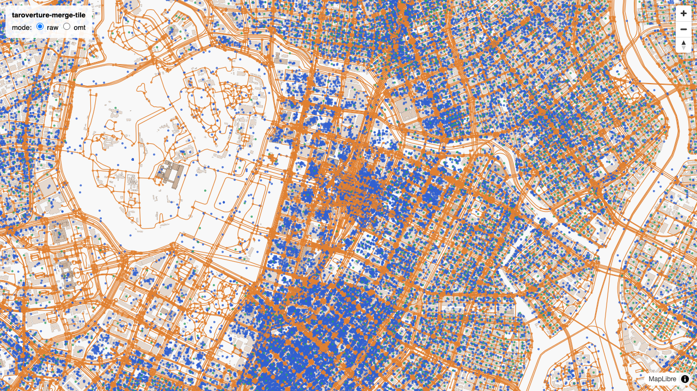
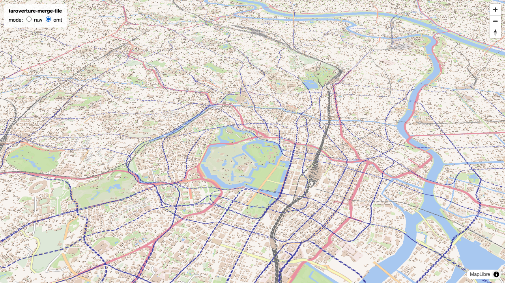

# poc-cng-taroverture-merge-tile

リモートにある 6 つの Overture PMTiles を、タイルリクエストごとに HTTP Range で部分取得して動的にマージし、OpenMapTiles スキーマのベクトルタイルとして配信する PoC。

## 仕組み

```
GET /tiles/{mode}/{z}/{x}/{y}.mvt
  -> 6 テーマの PMTiles から該当タイルを並列 Range fetch
  -> 各 MVT をデコード
  -> スキーマ変換 (transform/) を適用
  -> 1 枚の MVT に再エンコード -> gzip -> レスポンス
```

データソース: `https://dev.smellman.org/static/overture-latest/` の addresses / base / buildings / divisions / places / transportation (計約 565GB)。ダウンロードは一切せず、PMTiles の HTTP Range 読み取りだけで動く。

## モード

| mode | 説明 |
| --- | --- |
| `raw` | Overture のレイヤー名・属性をそのまま 1 枚にマージ (デバッグ・データ確認用) |
| `omt` | OpenMapTiles スキーマへ変換。変換器が登録されたレイヤーだけが出力される |

| raw (東京駅 z14) | omt (building 3D) |
| --- | --- |
|  |  |

## 使い方

```sh
npm install
npm start
# http://localhost:3000/ でデモ地図 (raw / omt 切り替え可能)
```

- `GET /health`
- `GET /tiles/raw/tile.json` / `GET /tiles/omt/tile.json`
- `GET /tiles/{mode}/{z}/{x}/{y}.mvt`

## 設計方針: スキーマ変換の疎結合

`src/transform/` は PMTiles・HTTP・MVT エンコードを一切知らない純粋なデータ変換モジュール。入出力は `{theme, layer, zoom, type, properties}` -> `[{layer, properties}]` のプレーンなデータのみで、ジオメトリには触らない。将来このディレクトリを独立リポジトリに切り出せば「PMTiles を一括ダウンロードして OpenMapTiles 形式に変換するバッチツール」にもそのまま流用できる。

変換の実装状況は `src/transform/omt/index.ts` のチェックリストを参照。

## 変換の実装状況

6 テーマすべての変換器が実装済み。出力レイヤーは building / transportation / transportation_name / water / landcover / landuse / park / boundary / place / poi / housenumber の 11 レイヤー。詳細は `src/transform/omt/index.ts` のチェックリストと各変換器のコメントを参照。

## 既知の制限 (PoC)

- divisions は z12 まで、base は z13 までしかタイルがなく、z13-14 でのオーバーズーム (親タイルからの切り出し) は未実装。z14 では boundary / water / landcover / landuse / park / place が欠ける
- poi の subclass は OMT の語彙ではなく Overture の basic_category をそのまま保持している
- poi の rank は OMT の rank と意味が異なり、Overture の confidence 由来 (1=高信頼 〜 10=低信頼)
- タイルキャッシュはプロセス内 LRU のみ

## テスト・型チェック

```sh
npm test           # ネットワークに出ない単体テストのみ (フェイク PMTiles ソースを注入)
npm run typecheck  # tsc --noEmit
```

TypeScript はビルドせず `tsx` でそのまま実行する (`npm start` / `npm run dev`)。
