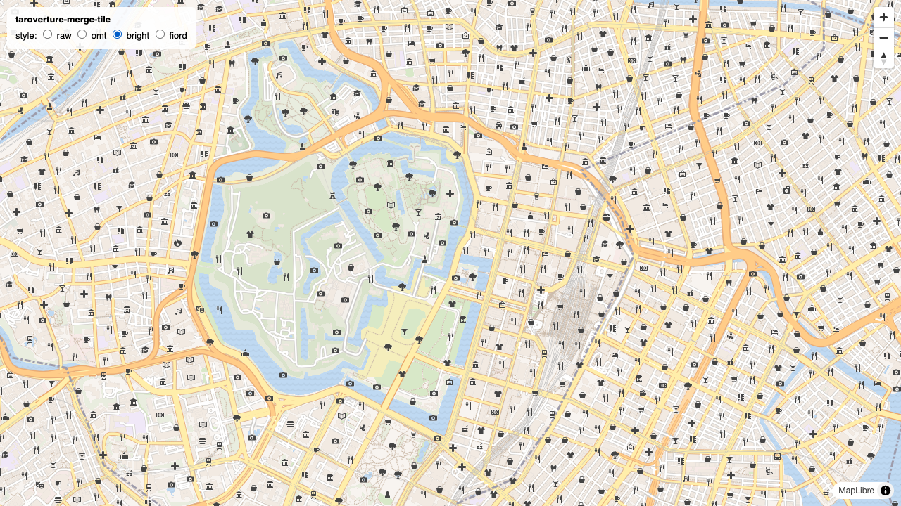
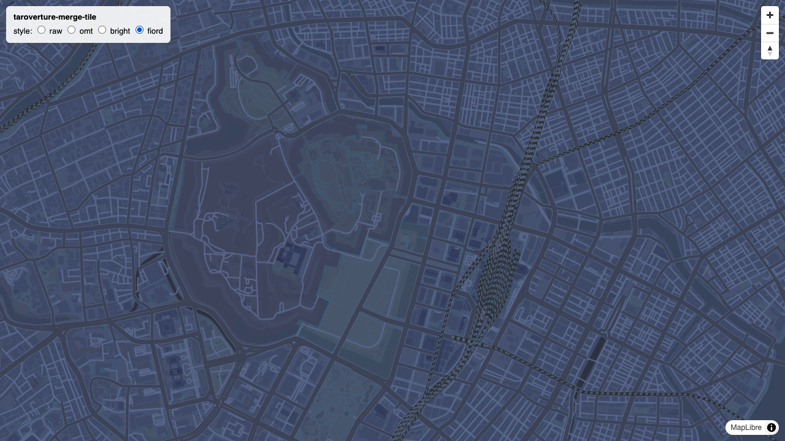

# poc-cng-taroverture-openmaptiles

リモートにある 6 つの Overture PMTiles を、タイルリクエストごとに HTTP Range で部分取得して動的にマージし、OpenMapTiles スキーマのベクトルタイルとして配信する PoC。

## 仕組み

```
GET /tiles/{mode}/{z}/{x}/{y}.mvt
  -> 6 テーマの PMTiles から該当タイルを並列 Range fetch
  -> 各 MVT をデコード
  -> スキーマ変換 (transform/) を適用
  -> 1 枚の MVT に再エンコード -> gzip -> レスポンス
```

データソース: `https://dev.smellman.org/static/overture-latest/` の addresses / base / buildings / divisions / places / transportation (計約 565GB)。ダウンロードは一切せず、PMTiles の HTTP Range 読み取りだけで動く。

## モード

| mode | 説明 |
| --- | --- |
| `raw` | Overture のレイヤー名・属性をそのまま 1 枚にマージ (デバッグ・データ確認用) |
| `omt` | OpenMapTiles スキーマへ変換。変換器が登録されたレイヤーだけが出力される |

| raw (東京駅 z14) | omt (building 3D) |
| --- | --- |
|  |  |

## 使い方

```sh
npm install
npm start
# http://localhost:3000/ でデモ地図 (raw / omt 切り替え可能)
```

- `GET /health`
- `GET /tiles/raw/tile.json` / `GET /tiles/omt/tile.json`
- `GET /tiles/{mode}/{z}/{x}/{y}.mvt`
- `GET /styles/osm-bright` / `GET /styles/osm-fiord` (docs/ のスタイル JSON の `sources.openmaptiles.url` を自サーバに書き換えて配信)

デモビューワーは raw / omt (自前スタイル) / bright / fiord の 4 スタイルを切り替えられる。bright / fiord は既存の OpenMapTiles 用スタイルがほぼ無改変で動くことの実証。

| OSM Bright | Fiord Color |
| --- | --- |
|  |  |

## Knative へのデプロイ

ステートレス (キャッシュはプロセス内 LRU のみ) なので、スケールトゥゼロする Knative Service と相性がいい。マニフェストはクラスタごとに `k8s/local/` と `k8s/z/` に分かれている。

### local (docker-desktop + Knative Serving + Kourier)

```sh
docker build -t dev.local/poc-cng-taroverture-openmaptiles:0.1.1 .
kubectl apply -f k8s/local/namespace.yaml -f k8s/local/ksvc.yaml

# cluster-local ドメインなので内部ゲートウェイ経由で確認
kubectl port-forward -n kourier-system svc/kourier-internal 18081:80 &
curl -H "Host: taroverture-openmaptiles.knative-pool.svc.cluster.local" \
  http://localhost:18081/tiles/omt/14/14552/6451.mvt -o tile.mvt.gz
```

イメージ名の `dev.local/` プレフィックスは Knative の tag-to-digest 解決 (レジストリ問い合わせ) をスキップするため。

### z クラスタ (local image import)

z 上で:

```sh
docker build -t taroverture-openmaptiles:0.1.1 .
docker save taroverture-openmaptiles:0.1.1 | ctr -n k8s.io images import -
kubectl apply -f k8s/z/ksvc.yaml
curl http://taroverture-openmaptiles.yuiseki.com/health
```

素のイメージ名は docker.io 扱いになり、`registries-skipping-tag-resolving` (docker.io) で digest 解決がスキップされる。

### 共通の設計判断

初回リクエストは PMTiles の header/directory fetch が走るため、`scale-down-delay: 60s` でウォーム済み pod (ディレクトリキャッシュ・タイル LRU) をしばらく残す。

## 設計方針: スキーマ変換の疎結合

`src/transform/` は PMTiles・HTTP・MVT エンコードを一切知らない純粋なデータ変換モジュール。入出力は `{theme, layer, zoom, type, properties}` -> `[{layer, properties}]` のプレーンなデータのみで、ジオメトリには触らない。将来このディレクトリを独立リポジトリに切り出せば「PMTiles を一括ダウンロードして OpenMapTiles 形式に変換するバッチツール」にもそのまま流用できる。

変換の実装状況は `src/transform/omt/index.ts` のチェックリストを参照。

## 変換の実装状況

6 テーマすべての変換器が実装済み。出力レイヤーは building / transportation / transportation_name / water / landcover / landuse / park / boundary / place / poi / housenumber の 11 レイヤー。詳細は `src/transform/omt/index.ts` のチェックリストと各変換器のコメントを参照。

## オーバーズーム

divisions は z12 まで、base は z13 までしかタイルがないため、それを超えるズームでは祖先タイル (maxzoom) を取得してジオメトリを子タイル座標へ変換する (`c = p * scale - d * extent`)。子タイル範囲にかからないフィーチャは bbox 判定で破棄する。ポリゴンの厳密なクリップはせずレンダラ側のクリップに任せる。

## 既知の制限 (PoC)

- オーバーズームは bbox 判定のみでポリゴンをクリップしないため、子タイル範囲を大きく跨ぐフィーチャはタイルサイズを膨らませる
- OMT の waterway (河川ライン)・aeroway (滑走路)・water_name・mountain_peak レイヤーは未生成 (Overture 側に対応する線・点データがないか未実装)。既存スタイルではコンソールに source layer 警告が出るが描画は継続される
- Overture (Meta 由来) の POI は OSM より桁違いに密度が高く、OSM Bright 等の rank フィルタ前提のスタイルでは z14 で POI アイコンが過密になる
- poi の subclass は OMT の語彙ではなく Overture の basic_category をそのまま保持している
- Overture の segment は交差点 (connector) 単位で細切れのため、線に沿う道路名ラベルを置ける長さのジオメトリが少ない。本家 OMT はタイル内で同名道路を linemerge してから transportation_name に入れており、同等の改善には後処理フックでのジオメトリ結合が必要
- タイルキャッシュはマージ済み出力のプロセス内 LRU のみ。overzoom で複数の子タイルが同じ親タイルを参照する場合も upstream を都度 fetch する

## POI の間引き

Overture (Meta 由来) の POI は OSM より桁違いに密 (東京駅 z14 で 6519 件/タイル) なため、2 段階で間引く:

1. 変換器 (per-feature): `confidence < 0.7` を破棄し、連絡先系属性 (websites/phones/socials/emails/brand) の保有数を richness スコアとして算出
2. レイヤー後処理 (per-tile): (richness, confidence) 降順でソートして上位 1000 件にキャップし、順位帯から rank を付与する。rank の値域は OMT スタイルの流儀 (top100=10, 次150=20, 30/40/50) に合わせており、OSM Bright の poi-level-1/2/3 (z14: rank<=14, z15: 15-24, z16: >=25) のズーム別出し分けがそのまま機能する

タイル単位の処理は per-feature の純粋関数では書けないため、transform モジュールに「レイヤー後処理」フック (`LayerPostProcessors`) を追加した。merge 側はフックを呼ぶだけでスキーマ知識は持たない。

## テスト・型チェック

```sh
npm test           # ネットワークに出ない単体テストのみ (フェイク PMTiles ソースを注入)
npm run typecheck  # tsc --noEmit
```

TypeScript はビルドせず `tsx` でそのまま実行する (`npm start` / `npm run dev`)。
